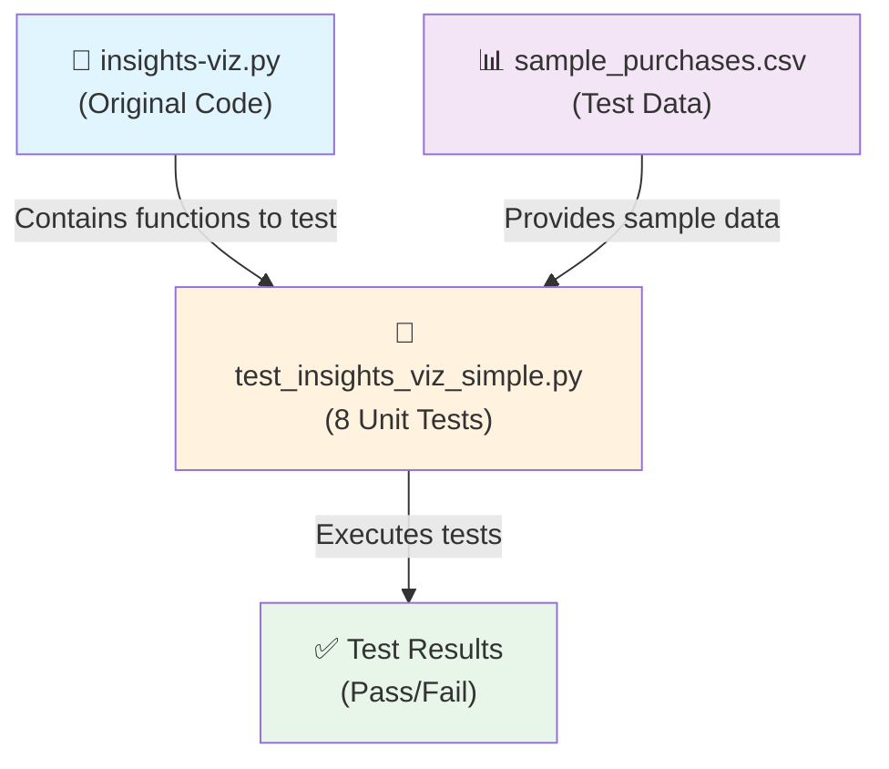
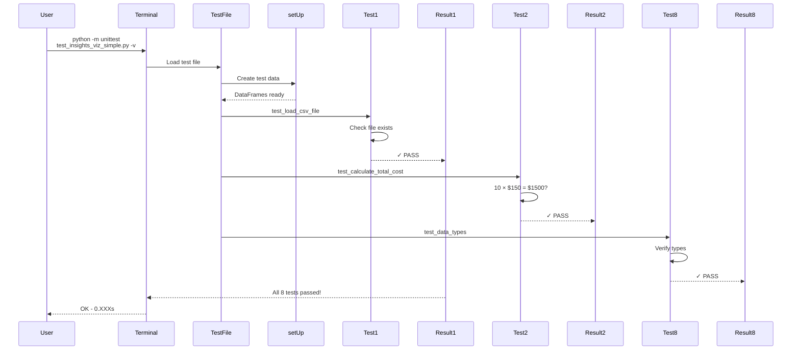
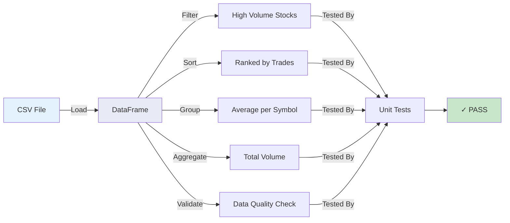
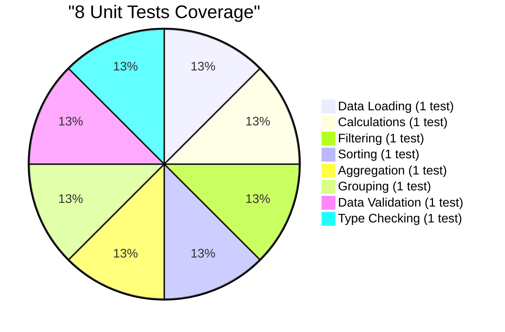
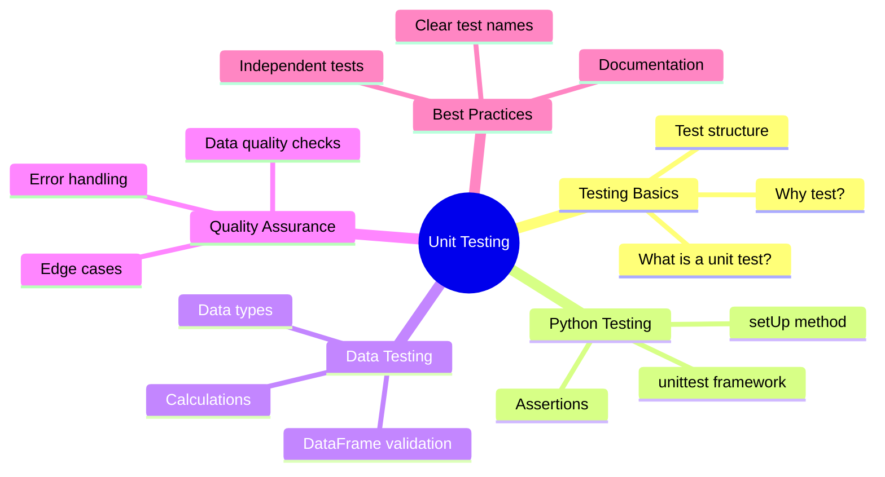
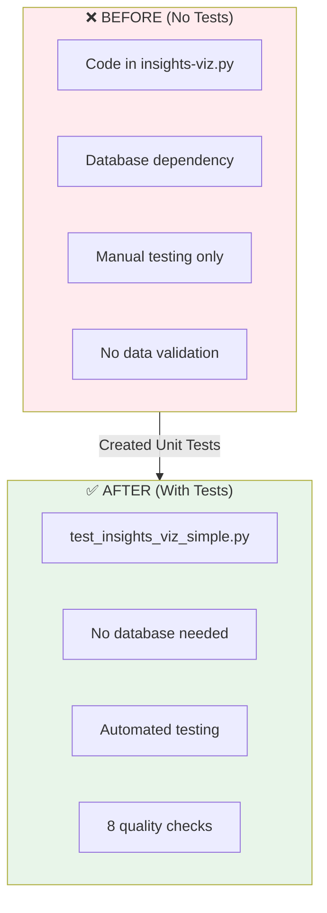

# Unit Testing Workflow Diagram

## System Architecture

---

## Test Execution Flow

---

## Data Processing Pipeline

---

## Test Coverage Breakdown

---

## Skills & Concepts Covered

---

## Before vs After Comparison

